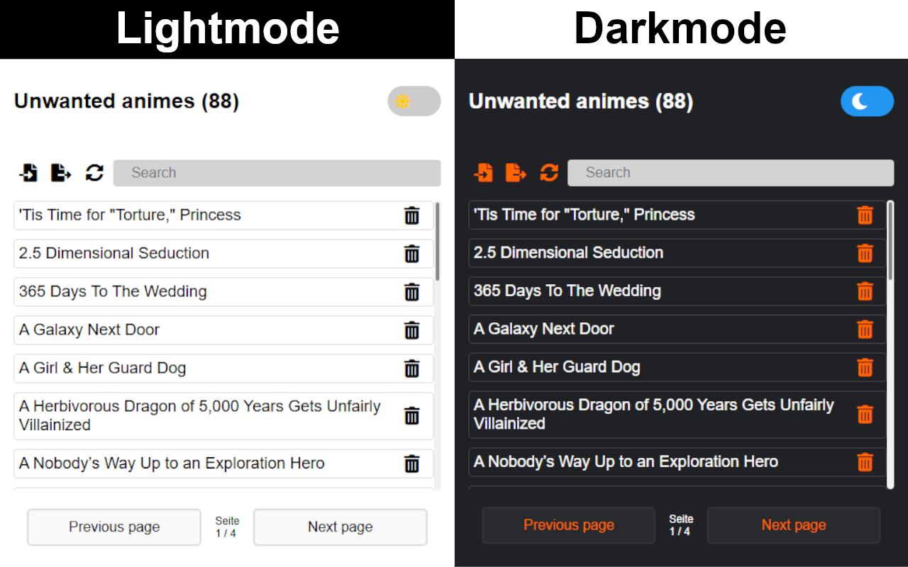

# NoMoreAnime
 The NoMoreAnime Extension is a browser extension that lets users hide anime shows they don't want to see in the new releases section of the Crunchyroll website. It offers a personalized and clutter-free browsing experience tailored to individual preferences.
 ___

 
Introducing NoMoreAnime Extension - your ultimate solution to customize your Crunchyroll experience! With this powerful browser extension, you can effortlessly hide all the anime shows you're not interested in. This will make it easier than ever to navigate through the latest releases on Crunchyroll.

Are you tired of scrolling through countless titles that don't pique your interest? With Crunchyroll Hide Unwanted Anime Extension, you've taken back control of your anime-watching journey.

With a clean and user-friendly interface, NoMoreAnime Extension seamlessly integrates with your Crunchyroll browsing experience. Stay up to date with the latest releases while maintaining a clean interface tailored to your tastes.

Never miss the anime that really speaks to you again. Use Crunchyroll Hide Unwanted Anime Extension and enjoy a personalized Crunchyroll experience like never before. Get started today and discover a whole new world of anime tailored to your preferences.

Currently, you can easily hide individual anime series/movies, but stay tuned for even more exciting functionalities coming soon! Customize your Crunchyroll journey like never before with the NoMoreAnime Extension.

## Hint

Please note that the extension may currently have some minor bugs. If you encounter any issues, simply reload the extension, 
refresh the Crunchyroll webpage, and it should start working again.

Otherwise, please open an issue on GitHub, and I will do my best to address it promptly. 
Your feedback and contribution are highly appreciated in improving the functionality of the extension.

That's my first browser extension, and it's just a hobby for me. I'm eager to learn as much as possible.

## TODO

- [x] DarkMode
- [x] Searchbar
- [x] Pagination
- [x] Account sync between Browsers (free)
- [ ] Set anime as viewed (pro episode / pro season)
- [ ] Anilist integration (sync)
- [ ] **(NEW)** Modular system for customizing content
- [ ] **(NEW)** Showcasing and hiding modules
- [ ] **(NEW)** Interactive customizable modules

## Ideas
 _No actually ideas_

## Support

Please provide feedback, ideas, suggestions, and report any issues through the support page (GitHub project). 
We appreciate your input and will address your concerns as promptly as possible.

## Screenshots

_Last edit 01.12.2024_

## Changelog

___

### 1.2 More beautiful design and features

_Changes_
- Update lightmode and darkmode
- Replace text to symbols
- Make clean more design
- Update pagination bar
- Update images in [README](README.md)

_Added_
- **(NEW)** Browser sync
- **(NEW)** Reset button

### 1.1 New ideas and little changes

_Changes_
- Page size from _`6`_ to _`25`_ 
- Add designed scrollbar for unwatched animes
- Update images in [README](README.md)

_Added_
- [ ] **(NEW)** Modular system for customizing content
- [ ] **(NEW)** Showcasing and hiding modules
- [ ] **(NEW)** Interactive customizable modules

_Moved from ideas to todos_
- [ ] Anilist integration (sync)

___

### 1.0 First upload
___